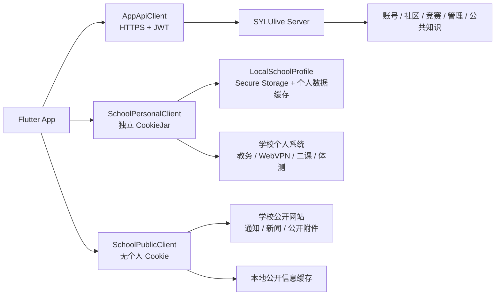

<div align="center">
  
  
  
  
  
</div>

# 沈理校园（SYLUlive）

沈理校园是面向沈阳理工大学学生的综合校园应用，采用 Flutter、Go、Python 与 PostgreSQL 构建，覆盖账号、校园社区、竞赛、生活服务、公开校园信息和本机教务等场景。

项目正在从“学校身份驱动的社区账号 + 服务端教务能力”迁移为：

```text
Email 主账号
        +
一次性校园准入
        +
设备本地 LocalSchoolProfile
        +
Server Zero School Authority
```

本分支 `jiaowu` 以 `MCP` 为基线，README 描述的是本次重构的目标架构和迁移边界。目标架构尚未因文档更新而自动视为完成；只有通过最终验收后，才能宣称 `Server Zero School Authority — Verified`。

## 🌟 核心能力

### 📚 本机教务与校园服务

- **本地课表与多学期数据**：课表、成绩、考试、学分要求、学业情况、二课和体测由设备本地能力处理。
- **本地学校会话**：使用随机 UUID 的 `LocalSchoolProfile` 管理账号命名空间，学校凭据进入 Android Keystore 或 iOS Keychain-backed storage。
- **Fail-closed 解析**：学校页面结构变化、登录页或异常响应不会被误显示为“暂无数据”，而是返回可解释的结构不匹配错误。
- **账号隔离**：切换本机学校账号时关闭旧 Vault、清理内存并重新挂载新 Profile，避免 A/B 账号数据串流。

### 🤖 AI 校园助手

- **公共知识问答**：使用已发布的校园政策、公共服务说明和允许的社区数据。
- **个人数据隔离**：成绩、课表、二课、体测等学校个人数据不进入 Server AI、Device Job 或远程 MCP 工具链。
- **受控集成**：外部 MCP 只能作为可选的版本化、白名单化集成，不能成为学校权限或个人学校数据的隐藏入口。

### 💬 校园互动社区

- **水贴广场**：实名或匿名发帖、图片上传、多级评论、点赞、举报和分类信息流。
- **校园集市与曝光台**：闲置物品流转、交易状态、避坑信息和标签搜索。
- **教师与专业评价**：面向学生的教师、课程、专业和校园生活评价体系。

### 🏆 竞赛、生活与治理

- **竞赛中心**：公开赛事目录、赛事详情、竞赛比较和个人计划。
- **校园服务**：校历、食堂、公共通知和其他公开校园信息。
- **社区治理**：版主、管理员和超级管理员的权限边界、审计以及输入和上传校验。

---

## 🎞️ 参考动画效果

本节参考 [emilkowalski/skills](https://github.com/emilkowalski/skills) 中的设计工程与动效经验，并转译为 Flutter/SYLUlive 的实现方式。它是动效参考索引，最终以 [`docs/design/MOTION.md`](./docs/design/MOTION.md)、[`docs/design/DESIGN_SYSTEM.md`](./docs/design/DESIGN_SYSTEM.md) 和 [`docs/design/ACCESSIBILITY.md`](./docs/design/ACCESSIBILITY.md) 为准。

### 动效决策顺序

1. **先判断是否需要动画**：输入、滚动、返回、高频 Tab 等高频操作优先即时反馈；不要为了“看起来更酷”增加动画。
2. **明确动画目的**：只能用于反馈、状态提示、空间连续性、避免内容突然出现/消失或首次引导解释。
3. **再选择曲线与时长**：进入/退出使用 ease-out，屏幕内移动使用 ease-in-out；普通 UI 尽量控制在 300ms 内。
4. **优先 transform 与 opacity**：避免直接动画大列表的 height、width、padding、margin；禁止从 `scale(0)` 出现，使用轻微缩放配合透明度。
5. **保证可中断与可访问**：拖拽使用 spring/速度判断；尊重 `MediaQuery.disableAnimationsOf(context)`，降低动效时保留透明度或颜色反馈。

### 效果速查

| 效果 | 适用场景 | Flutter 参考实现 | 建议节奏 |
| --- | --- | --- | --- |
| **Press / Tap feedback** | 主按钮、可交互卡片 | `InkWell` 状态层或 `AnimatedScale` | `0.95–0.98`，约 100–160ms；不用于输入、滚动和导航本身 |
| **Fade + Scale in** | 内容替换、轻量状态切换 | `AnimatedSwitcher`、`FadeTransition` + `ScaleTransition` | 从 `0.95` 到 `1.0`，使用 `AppMotion.incoming` |
| **Slide in / Direction-aware transition** | 页面、详情、抽屉 | `SlideTransition` + `FadeTransition`、现有 `page_transitions.dart` | 由空间方向决定位移；复用 `AppMotion.tab/page` |
| **Origin-aware pop in** | 菜单、Popover、Tooltip | `ScaleTransition(alignment: ...)` + `FadeTransition` | 从触发控件方向出现；弹窗居中，不能套用触发点原点 |
| **Crossfade / State morph** | 图标、按钮文案、加载到结果 | `AnimatedSwitcher` 或 `AnimatedOpacity` | 入场快、退场清晰；快速重复触发必须可中断 |
| **Stagger / Orchestration** | 首次进入的列表或网格 | `Interval` + `FadeTransition` / `SlideTransition` | 每项间隔 20–35ms；只用于偶发首次进入，不能阻塞交互 |
| **Spring / Rubber-banding** | 拖拽、滑动关闭、越界回弹 | `AnimationController` + `SpringSimulation` | 根据手势速度决定是否关闭，边界使用阻尼，动画可被新手势打断 |
| **Reveal** | 首次引导、图片或重点内容展示 | `ClipRect` / `ClipPath` 配合透明度 | 低频使用；不作为信息流和高频 Tab 的默认转场 |

### 项目落地规则

- 动画参数统一复用 `client/lib/theme/app_motion.dart` 中的 `AppMotion`，旧路径仅保留临时 deprecated shim，不得在页面里创建第二套 duration/curve token。
- Web 参考中的 CSS `clip-path`、hover、Framer Motion 等概念不能直接搬入 Flutter；优先使用 Flutter 原生动画组件和现有路由实现。
- `BackdropFilter`、重 blur、全量列表 stagger 不是默认方案；只有在视觉问题已被验证且通过性能检查时才考虑。
- 高频 Tab 重复切换不重播大型 reveal；首次访问可以使用 reveal，已访问页面最多保留短暂 opacity 反馈。
- reduced motion 下删除大距离位移、scale 和装饰性 stagger，但保留能解释状态变化的 opacity/color 反馈。

### 外部参考入口

- [Design Engineering](https://github.com/emilkowalski/skills/blob/main/skills/emil-design-eng/SKILL.md)：动效决策、曲线、时长、性能与无障碍原则。
- [Animate](https://github.com/emilkowalski/skills/blob/main/skills/animate/SKILL.md)：从“是否应该动”到“如何实现”的构建顺序。
- [Review Animations](https://github.com/emilkowalski/skills/blob/main/skills/review-animations/SKILL.md)：动效代码审查清单。
- [Find Animation Opportunities](https://github.com/emilkowalski/skills/blob/main/skills/find-animation-opportunities/SKILL.md)：筛选真正值得增加动画的交互缝隙。
- [Animation Vocabulary](https://github.com/emilkowalski/skills/blob/main/skills/animation-vocabulary/SKILL.md)：为 Fade、Pop、Stagger、Morph、Rubber-banding 等效果建立统一术语。

---

## 🧭 账号与领域边界

| 领域 | 负责内容 | 关键边界 |
| --- | --- | --- |
| Account Domain | `users.id`、Email、APP Password、JWT、社区资料、角色与账号安全 | 不依赖学号、学校 Cookie、教务在线状态或 `SchoolProfile` |
| Registration Trust Domain | 判断本次注册是否具备校园准入资格 | 只参与注册/迁移，不参与登录、找回密码或本地教务 |
| Local School Domain | 学号、学校密码、Cookie、课表、成绩、考试、二课、体测和学业数据 | 只存在设备，不上传 Server，不决定 `users.id` |
| School Public Information Domain | 教务通知、学校新闻、创新创业通知和公开附件 | 当前产品策略为设备抓取、本地缓存，与个人学校 Client 隔离 |

目标账号模型：

```text
users.id = 永久社区账号主体
verified Email = 唯一正式登录身份
APP Password = SYLUlive 账号凭据
LocalSchoolProfile = 设备本地学校账号
```

目标迁移期会引入 `user_login_identities` 和 `registration_sessions`。最终注册事务必须幂等且最多创建一个 `users.id`；邮箱变更是高风险认证操作，不是普通 Profile 字段更新。

## 🏛️ 目标架构



`Server` 与学校个人系统、本地学校缓存之间没有业务链路。学校凭据、Cookie、课表、成绩和其他学校个人数据只在设备侧安全存储与本地缓存中流转。

## 🛡️ Server Zero School Authority

目标架构用“四个零”验收 Server 边界：

| 安全不变量 | Server 不得具备的能力 |
| --- | --- |
| Zero Credential | 不持有 Student Password、CAS/WebVPN 凭据、Ticket、JSESSIONID 或学校 Cookie |
| Zero Personal School Data | 不保存学号、姓名、学院、专业、年级、课表、成绩、考试、二课、体测或学校个人快照 |
| Zero School Authority | 不登录、代理或调用学校个人接口，不远程命令设备访问学校或读取学校缓存 |
| Zero Hidden Fallback | 本地学校能力失败后不恢复 Server School Authority |

因此，服务端最终只保留账号、社区、竞赛、管理以及经过边界审查的公共知识能力。AI Runtime 和 Device Bridge 不注册或读取 `academic.*`、个人 `schedule`、`erke`、`physical` 和学业身份工具。

## 🔄 分阶段迁移

迁移遵循“先建立新路径，再删除旧路径”的顺序：

| 阶段 | PR 范围 | 目标 |
| --- | --- | --- |
| 账号与安全基础 | PR0–PR4 | 收紧学校 TLS、建立边界 ADR、预检身份数据、Email Identity、一次性校园准入 |
| 本地学校能力 | PR5–PR9 | Gateway、三套 HTTP Client、本地会话与安全存储、课表/成绩/考试/二课/公开资讯本地化 |
| 远程能力退役 | PR10–PR12 | 先阻断旧客户端，再移除 Device School Tools、旧 `/edu/*`、服务端学校数据读写并完成清理 |
| 最终验收 | PR13 | Canary、数据库、日志、AI Runtime、Device Job 与 egress 四个零验证 |

```text
Local-First 新客户端稳定
        ↓
提高 MinimumSupportedVersionCode
        ↓
旧客户端 → 426 Upgrade Required
        ↓
删除 Server → Device School Capability
        ↓
旧 /edu/* → 410 Gone（读取 Body 前直接返回）
        ↓
停止读写后清理数据库、AI、日志、备份与密钥
        ↓
Canary + 四个零最终验收
```

在 PR10 完成前，不宣称 `Server Zero School Authority`；在 PR12/PR13 完成前，不宣称 `Server Zero School Data Verified`。安全边界切换后，不以修复功能为由自动恢复 Server Academic、学校上传或远程学校 Device Tool。

## 🤖 AI 与 MCP 边界

- AI 可使用已发布的公共政策、公共服务说明和允许的社区数据。
- 个人成绩、课表、二课、体测等学校个人数据不进入 Server AI、Device Job 或远程 MCP 工具链。
- 外部 MCP 只能作为可选的版本化、白名单化集成，不能成为学校权限或个人学校数据的隐藏入口。
- 现有 [内部 Hy3 MCP 部署文档](./docs/ai/internal-hy3-mcp-deployment.md) 属于迁移基线参考，启用前必须重新完成 School Authority 边界审查。

---

## 📂 仓库结构

```text
SYLUlive/
├── client/                 Flutter 客户端、LocalSchoolProfile 与本地校园能力
├── server/                 Go 账号、社区、竞赛、AI Runtime 与公共服务
├── python-edu-service/     迁移期旧教务链路，目标阶段后退出生产路径
├── python-rag-service/     公共政策与文档解析、分词和向量服务
├── knowledge-base/         校园公共政策资料与导入包
├── docs/                   架构、部署、隐私和专项说明
├── deploy/                 systemd 与部署配置
├── nginx/                  反向代理配置
├── DEPLOY.md               部署与运维文档
├── server/API.md           后端接口文档
└── docker-compose.yml      本地容器编排
```

---

## 📌 迁移状态

- **迁移基线**：`MCP` 分支。
- **当前工作分支**：`jiaowu`，用于承载本次本机教务与账号架构重构。
- **目标架构状态**：Draft for implementation，按 PR0–PR13 分阶段推进。
- **验收声明**：在 PR13 完成前，不对外宣称 `Server Zero School Authority — Verified`。

---

## 🚀 本地开发

### 1. 启动 Go 后端

```bash
cd server
go run ./cmd/main.go
```

默认监听 `http://localhost:8080`。数据库、内部服务令牌等配置请参考 `.env.example` 和部署文档。

### 2. 启动 Flutter 客户端

```bash
cd client
flutter pub get
flutter run
```

本地联调时，将客户端 API 地址指向开发机可访问的 Go 服务地址。学校个人服务由客户端直接连接，不通过 Go 后端代理。

### 3. 启动 RAG 服务

```bash
cd python-rag-service
uvicorn app.main:app --host 127.0.0.1 --port 8090
```

### 4. 迁移期兼容教务服务（可选）

```bash
cd python-edu-service
python main.py
```

该服务仅用于迁移期旧链路维护和兼容性验证，不代表目标架构允许 Server 持有学校权限或个人教务数据。Local-First 客户端稳定后，应按迁移计划逐步退出生产路径。

### 5. 外部 MCP（可选）

MCP 不是运行本机教务所需的前置服务。若部署受控的公共信息或决策集成，请先阅读 [内部 Hy3 MCP 部署文档](./docs/ai/internal-hy3-mcp-deployment.md)，并完成工具白名单、Schema、健康检查和个人学校数据边界审查。

---

## 📖 文档

- [部署与运维指南](./DEPLOY.md)
- [后端 API](./server/API.md)
- [本地存储清单](./docs/local-storage-inventory.md)
- [隐私数据清单](./docs/privacy-data-inventory.md)
- [留存与备份清单](./docs/retention-and-backup-inventory.md)
- [内部 Hy3 MCP 部署基线](./docs/ai/internal-hy3-mcp-deployment.md)
- [校园政策知识库](./knowledge-base/README.md)
- [独立 SYLUlive_MCP](https://github.com/zhouwu97/SYLUlive_MCP)

---

## 🏗️ 提交前检查

客户端：

```bash
cd client
flutter analyze
flutter test
```

服务端：

```bash
cd server
go test ./...
go build ./...
```

RAG 服务：

```bash
cd python-rag-service
pytest -q
```

重构相关变更还必须检查：

- 学校个人凭据、Cookie 和个人教务数据不会进入 Server、日志、AI、Device Job、队列或备份；
- `AppApiClient`、`SchoolPersonalClient`、`SchoolPublicClient` 的 Cookie 与认证头完全隔离；
- 本地教务失败没有 Server fallback；
- Parser 对登录页、WAF、空页面、结构变化和字段缺失 fail-closed；
- 生产路径没有通用 TLS 验证绕过。

---

## 🙏 致谢

- [syluinfo - atopos31](https://github.com/atopos31/syluinfo)：教务系统接入参考。

<p align="center">
  <i>Make campus life better.</i>
</p>
