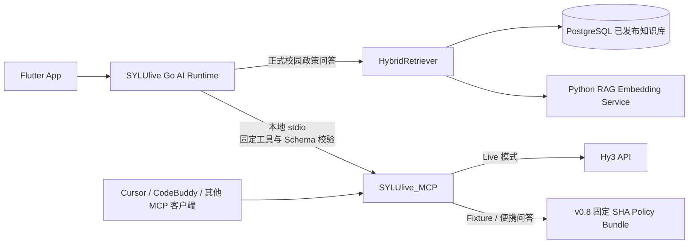

<div align="center">
  
  
  
  
  
</div>

# 沈理校园（SYLUlive）

沈理校园是面向沈阳理工大学学生的综合校园应用，采用 Flutter、Go、Python 与 PostgreSQL 构建，覆盖教务查询、课表、成绩、校园社区、竞赛、生活服务和 AI 校园助手等场景。

项目将**生产校园数据检索**与**外部模型决策能力**分开：正式政策问答由主服务的 Go HybridRetriever 和已发布知识库完成；独立仓库 [SYLUlive_MCP](https://github.com/zhouwu97/SYLUlive_MCP) 通过本地 `stdio` 提供可移植、可审计的 Hy3 决策工具。

## 🌟 核心功能

### 📚 教务与校园工具

- **智能课表与多学期缓存**：支持官方课表同步、学期切换、冲突检测和 Android 桌面小部件。
- **成绩、考试与学分查询**：查询历史成绩、考试安排、培养方案学分要求和二课进度。
- **竞赛中心**：提供学校竞赛目录、个人计划、赛事比较和面向年级、学院、专业的候选推荐。
- **校园政策问答**：支持“挂科怎么办”“重修”“交不起学费”“勤工俭学”“奖学金怎么评”等学生口语查询。

### 🤖 AI 校园助手

- **生产 RAG**：基于 PostgreSQL 已发布知识文档、全文检索、向量检索和确定性意图契约回答校园政策问题。
- **个人数据授权**：成绩、课表、二课等个人数据按用途授权，支持云端快照和设备侧最小化取数。
- **外部 MCP 决策工具**：通过严格 Schema、工具白名单和版本摘要调用竞赛比较、学业分析和周计划工具。
- **安全降级**：Hy3 或独立 MCP 不可用时，正式校园政策检索和本地确定性结果仍可继续工作。

### 💬 校园互动社区

- **水贴广场**：实名或匿名发帖、图片上传、多级评论、点赞、举报和分类信息流。
- **校园集市与曝光台**：闲置物品流转、交易状态、避坑信息和标签搜索。
- **教师与专业评价**：面向学生的教师、课程、专业和校园生活评价体系。

### 🛡️ 社区治理与安全

- **分级管理体系**：支持版主、管理员和超级管理员的权限边界与审计。
- **公告与通知**：系统公告、未读状态、课程提醒和隐私受控的 AI 任务通知。
- **输入与上传校验**：限制文件类型、大小、访问范围以及个人数据字段。

---

## 🎞️ 参考动画效果

本节参考 [emilkowalski/skills](https://github.com/emilkowalski/skills) 中的设计工程与动效经验，并转译为 Flutter/SYLUlive 的实现方式。它是动效参考索引，最终以 [`docs/design/MOTION.md`](./docs/design/MOTION.md)、[`docs/design/DESIGN_SYSTEM.md`](./docs/design/DESIGN_SYSTEM.md) 和 [`docs/design/ACCESSIBILITY.md`](./docs/design/ACCESSIBILITY.md) 为准。

### 动效决策顺序

1. **先判断是否需要动画**：输入、滚动、返回、高频 Tab 等高频操作优先即时反馈；不要为了“看起来更酷”增加动画。
2. **明确动画目的**：只能用于反馈、状态提示、空间连续性、避免内容突然出现/消失或首次引导解释。
3. **再选择曲线与时长**：进入/退出使用 ease-out，屏幕内移动使用 ease-in-out；普通 UI 尽量控制在 300ms 内。
4. **优先 transform 与 opacity**：避免直接动画大列表的 height、width、padding、margin；禁止从 `scale(0)` 出现，使用轻微缩放配合透明度。
5. **保证可中断与可访问**：拖拽使用 spring/速度判断；尊重 `MediaQuery.disableAnimationsOf(context)`，降低动效时保留透明度或颜色反馈。

### 效果速查

| 效果 | 适用场景 | Flutter 参考实现 | 建议节奏 |
| --- | --- | --- | --- |
| **Press / Tap feedback** | 主按钮、可交互卡片 | `InkWell` 状态层或 `AnimatedScale` | `0.95–0.98`，约 100–160ms；不用于输入、滚动和导航本身 |
| **Fade + Scale in** | 内容替换、轻量状态切换 | `AnimatedSwitcher`、`FadeTransition` + `ScaleTransition` | 从 `0.95` 到 `1.0`，使用 `AppMotion.incoming` |
| **Slide in / Direction-aware transition** | 页面、详情、抽屉 | `SlideTransition` + `FadeTransition`、现有 `page_transitions.dart` | 由空间方向决定位移；复用 `AppMotion.tab/page` |
| **Origin-aware pop in** | 菜单、Popover、Tooltip | `ScaleTransition(alignment: ...)` + `FadeTransition` | 从触发控件方向出现；弹窗居中，不能套用触发点原点 |
| **Crossfade / State morph** | 图标、按钮文案、加载到结果 | `AnimatedSwitcher` 或 `AnimatedOpacity` | 入场快、退场清晰；快速重复触发必须可中断 |
| **Stagger / Orchestration** | 首次进入的列表或网格 | `Interval` + `FadeTransition` / `SlideTransition` | 每项间隔 20–35ms；只用于偶发首次进入，不能阻塞交互 |
| **Spring / Rubber-banding** | 拖拽、滑动关闭、越界回弹 | `AnimationController` + `SpringSimulation` | 根据手势速度决定是否关闭，边界使用阻尼，动画可被新手势打断 |
| **Reveal** | 首次引导、图片或重点内容展示 | `ClipRect` / `ClipPath` 配合透明度 | 低频使用；不作为信息流和高频 Tab 的默认转场 |

### 项目落地规则

- 动画参数统一复用 `client/lib/theme/app_motion.dart` 中的 `AppMotion`，旧路径仅保留临时 deprecated shim，不得在页面里创建第二套 duration/curve token。
- Web 参考中的 CSS `clip-path`、hover、Framer Motion 等概念不能直接搬入 Flutter；优先使用 Flutter 原生动画组件和现有路由实现。
- `BackdropFilter`、重 blur、全量列表 stagger 不是默认方案；只有在视觉问题已被验证且通过性能检查时才考虑。
- 高频 Tab 重复切换不重播大型 reveal；首次访问可以使用 reveal，已访问页面最多保留短暂 opacity 反馈。
- reduced motion 下删除大距离位移、scale 和装饰性 stagger，但保留能解释状态变化的 opacity/color 反馈。

### 外部参考入口

- [Design Engineering](https://github.com/emilkowalski/skills/blob/main/skills/emil-design-eng/SKILL.md)：动效决策、曲线、时长、性能与无障碍原则。
- [Animate](https://github.com/emilkowalski/skills/blob/main/skills/animate/SKILL.md)：从“是否应该动”到“如何实现”的构建顺序。
- [Review Animations](https://github.com/emilkowalski/skills/blob/main/skills/review-animations/SKILL.md)：动效代码审查清单。
- [Find Animation Opportunities](https://github.com/emilkowalski/skills/blob/main/skills/find-animation-opportunities/SKILL.md)：筛选真正值得增加动画的交互缝隙。
- [Animation Vocabulary](https://github.com/emilkowalski/skills/blob/main/skills/animation-vocabulary/SKILL.md)：为 Fade、Pop、Stagger、Morph、Rubber-banding 等效果建立统一术语。

---

## 🔗 SYLUlive 与 SYLUlive_MCP 如何联动

两个仓库不是重复实现，也不是把 App 的全部 AI 功能交给外部模型，而是分别承担生产数据与独立决策能力。



### 职责划分

| 能力 | SYLUlive 主项目 | SYLUlive_MCP |
| --- | --- | --- |
| App 正式政策问答 | 使用生产 Go HybridRetriever 和数据库已发布文档 | 不读取生产数据库 |
| “挂科、重修、资助、奖学金”等意图 | 加载共享 v0.8 意图契约并执行生产检索 | 使用相同契约检索固定 SHA Bundle |
| 竞赛比较 | 提供真实赛事与用户授权数据，校验远端结果 | 执行四维比较并生成受约束解释 |
| 学业分析 | 生成非身份化学业快照并执行权限控制 | 本地计算学分、挂科和完整度，再由 Hy3 解释 |
| 周计划 | 提供固定课程、目标和用户约束 | 在睡眠、固定事件和每日上限内排程 |
| 便携 MCP 演示 | 作为可选调用方 | 可被 Cursor、CodeBuddy 等客户端直接启动 |

### 一致性与安全边界

- 两端共享 `policy_query_contract_v0.8.json`，保证粗略口语、精确问题和复合意图使用一致的路由规则。
- MCP 协议版本为 `sylulive-hy3/1`；Go 客户端同时校验 `tools/list`、状态工具声明和本地固定 Schema SHA-256。
- 当前生产兼容基线为 SYLUlive `53d8ed5f875e9d7174335b2965def05f377e1bf3`，配套
  `SYLUlive_MCP` 标签 `sylulive-mcp-prod-20260728`（实现 `765a5b634f18aaa616b3c424462572651c54b034`）。
- 政策 Bundle 使用 `newline-lf-v1` 规范化摘要，避免 Windows CRLF 与 Linux LF 导致部署校验漂移。
- 主服务只向 MCP 发送工具所需的结构化最小数据，不发送教务密码、Cookie、JWT 或其他身份凭据。
- 独立 MCP 不连接 SYLUlive 生产数据库，不修改用户账号和业务数据。
- 当前 App 通过 MCP 使用 `compare_competitions`、`analyze_academic_snapshot` 和 `plan_student_week`；`answer_campus_question` 主要服务于独立 MCP 客户端和便携演示。

详细部署方式见 [内部 Hy3 MCP 部署文档](./docs/ai/internal-hy3-mcp-deployment.md)。

---

## 📂 仓库结构

```text
SYLUlive/
├── client/                 Flutter 客户端
├── server/                 Go 后端、AI Runtime、HybridRetriever 与 MCP 客户端
├── python-edu-service/     教务抓取与结构化服务
├── python-rag-service/     文档解析、分词与向量服务
├── knowledge-base/         校园政策资料、意图契约与导入包
├── docs/                   架构、部署和专项说明
├── deploy/                 systemd 与部署配置
├── nginx/                  反向代理配置
├── DEPLOY.md               部署与运维文档
├── server/API.md           后端接口文档
└── docker-compose.yml      本地容器编排
```

---

## 📢 当前版本

### v1.6.2

- 上线校园政策 v0.8 检索，拆分困难认定、助学金、临时补助、助学贷款、勤工助学和奖学金资料。
- 支持宽泛问题与精确问题分流，例如“挂科怎么办”覆盖补考与重修，而“重修”只回答重修制度。
- 完成 Go 与独立 MCP 的版本化 Schema、摘要校验和真实 `stdio` 联调。
- 完善个人数据授权、设备侧取数、失败降级和来源证据展示。

---

## 🚀 本地开发

### 1. 启动 Go 后端

```bash
cd server
go run ./cmd/main.go
```

默认监听 `http://localhost:8080`。数据库、内部服务令牌等配置请参考 `.env.example` 和部署文档。

### 2. 启动 Flutter 客户端

```bash
cd client
flutter pub get
flutter run
```

本地联调时，将客户端 API 地址指向开发机可访问的 Go 服务地址。

### 3. 启动教务服务

```bash
cd python-edu-service
python main.py
```

### 4. 启动 RAG 服务

```bash
cd python-rag-service
uvicorn app.main:app --host 127.0.0.1 --port 8090
```

### 5. 可选：连接独立 MCP

克隆并安装 [SYLUlive_MCP](https://github.com/zhouwu97/SYLUlive_MCP)，再按照 [MCP 部署文档](./docs/ai/internal-hy3-mcp-deployment.md) 配置本地 `stdio` 命令。外部 MCP 默认应保持关闭，完成契约和健康检查后再启用。

---

## 📖 文档

- [部署与运维指南](./DEPLOY.md)
- [后端 API](./server/API.md)
- [内部 Hy3 MCP 部署](./docs/ai/internal-hy3-mcp-deployment.md)
- [校园政策知识库](./knowledge-base/README.md)
- [独立 SYLUlive_MCP](https://github.com/zhouwu97/SYLUlive_MCP)

---

## 🏗️ 提交前检查

客户端：

```bash
cd client
flutter analyze
flutter test
```

服务端：

```bash
cd server
go test ./...
go build ./...
```

RAG 服务：

```bash
cd python-rag-service
pytest -q
```

---

## 🙏 致谢

- [syluinfo - atopos31](https://github.com/atopos31/syluinfo)：教务系统接入参考。

<p align="center">
  <i>Make campus life better.</i>
</p>
