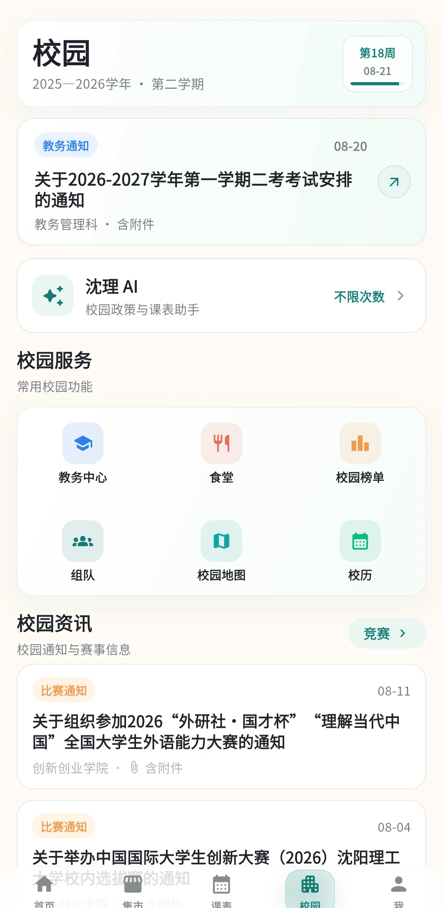
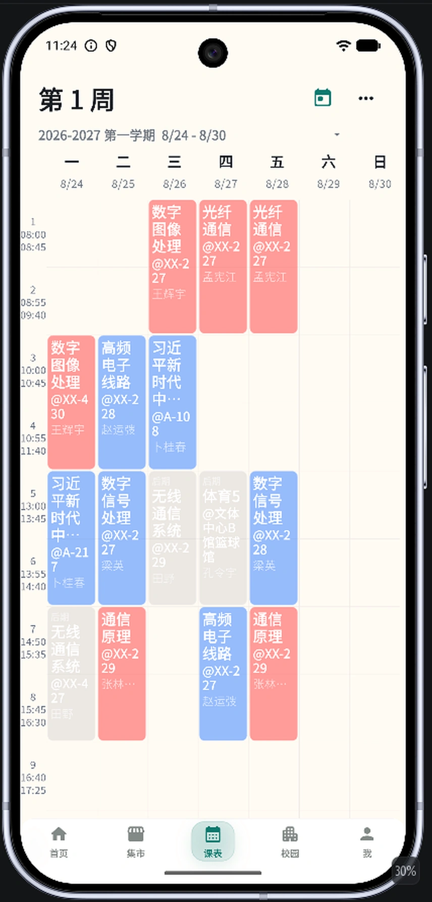
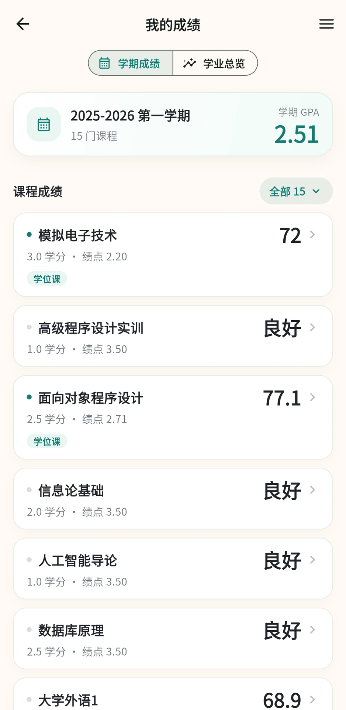
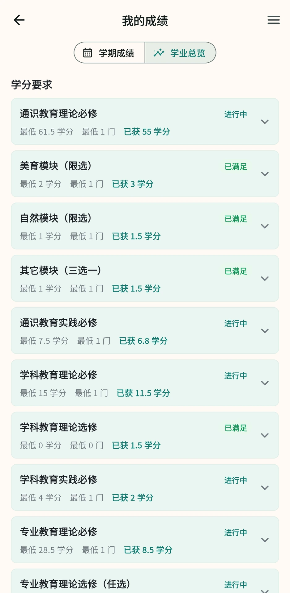
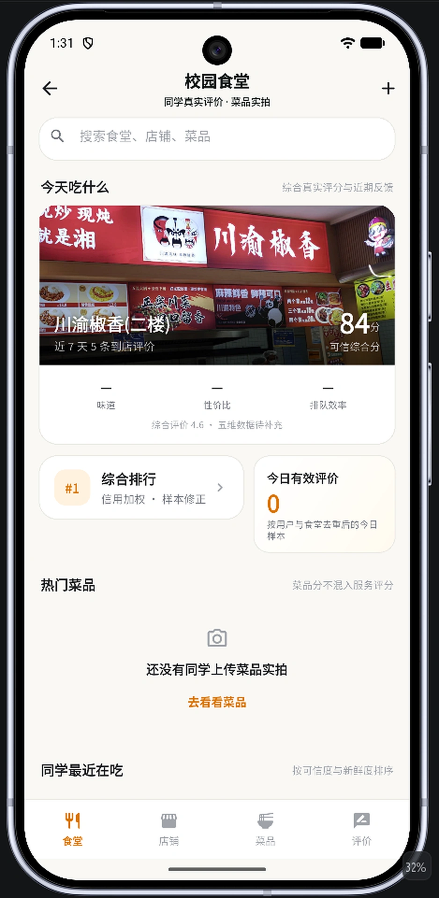

<div align="center">
  

# 沈理校园 · SYLUlive

### 沈理学生自己的校园 App

课表、成绩、考试、学业、食堂、社区、竞赛、通知和校园 AI，都放在一个 App 里。

**目前已有近 500 名用户加入。**

<p>
  <a href="https://sylulive.online/"><b>官方网站</b></a>
  ·
  <a href="https://sylulive.online/download.html"><b>下载 Android</b></a>
  ·
  <a href="https://github.com/zhouwu97/SYLUlive/releases">版本发布</a>
  ·
  <a href="./docs/README.md">文档中心</a>
  ·
  <a href="./DEPLOY.md">部署文档</a>
</p>

<p>
  
  
  
  
</p>
</div>

> [!NOTE]
> 沈理校园由学生开发和维护，是非官方校园应用，不代表沈阳理工大学官方立场。教务通知、考试安排、培养方案等重要信息请以学校官方渠道为准。

## 关于这个项目

沈理校园是一款面向沈阳理工大学学生的非官方校园应用。

从每天都会打开的课表，到成绩、考试和学业进度，再到食堂评价、校园社区、竞赛、组队和校园服务，我们希望把学生真正高频使用的功能放进一个 App。

不是把学校网站重新装进手机，而是重新整理校园信息和学生真正需要的使用方式。

## 界面预览

<table>
  <tr>
    <td align="center"><b>校园首页</b></td>
    <td align="center"><b>课程表</b></td>
    <td align="center"><b>成绩</b></td>
  </tr>
  <tr>
    <td></td>
    <td></td>
    <td></td>
  </tr>
  <tr>
    <td align="center"><b>学业总览</b></td>
    <td align="center"><b>校园食堂</b></td>
    <td align="center"><b>校园社区</b></td>
  </tr>
  <tr>
    <td></td>
    <td></td>
    <td></td>
  </tr>
</table>

## 现在可以用它做什么

| 模块 | 能力 |
| --- | --- |
| **课表** | 多学期、周次、课程详情、本地调课、课表存档、桌面小组件 |
| **成绩与学业** | 成绩、GPA、考试、学分要求、培养方案、二课、体测 |
| **食堂** | 店铺与菜品评价、用户实拍、评价历史、综合排行 |
| **校园社区** | 帖子、评论、关注、匿名、投票、二手、失物招领、曝光、私信 |
| **竞赛与组队** | 赛事中心、赛事信息、个人竞赛中心、获奖记录、组队招募 |
| **校园工具** | 校历、校园地图、试卷库、签到、通知和其他公开校园信息 |
| **反馈与治理** | Bug / 建议工单、处理进度、管理员沟通、举报与申诉 |
| **沈理 AI** | 校园政策、公开信息，以及经用户授权的个人校园辅助能力 |

## 下载与使用

目前主要面向 Android 用户提供正式版本。

- [官网下载](https://sylulive.online/download.html)
- [GitHub Releases](https://github.com/zhouwu97/SYLUlive/releases)
- App 内版本更新

安装和更新遇到问题，可以直接在 App 内提交反馈工单。

## 教务数据与隐私

新版客户端的个人教务访问正在转向设备侧完成，课表、成绩等个人数据优先在本地获取和保存。仓库仍保留迁移期兼容能力；具体数据处理范围以当前版本的隐私说明和生产配置为准。

```text
账号 / 社区 / 通知 / 竞赛 / 公共服务
                    │
                    ▼
              SYLUlive Server

个人教务访问 ──► 客户端本地安全存储与缓存 ──► 学校系统
```

学校密码、Cookie 和个人教务会话不应进入日志、AI、MCP、队列或备份。迁移期兼容服务是否启用由 `SCHOOL_AUTHORITY_RETIRED`、`SCHOOL_ACADEMIC_ROUTES_RETIRED` 等生产开关控制，不能仅依据 README 判断。

- [隐私数据台账](./docs/privacy-data-inventory.md)
- [本地存储清单](./docs/local-storage-inventory.md)
- [隐私发布检查](./docs/privacy-release-checklist.md)
- [留存与备份清单](./docs/retention-and-backup-inventory.md)
- [第三方服务清单](./docs/third-party-service-inventory.md)

## 技术实现

| 部分 | 技术 |
| --- | --- |
| 客户端 | Flutter / Dart / Kotlin |
| 服务端 | Go / Gin / GORM |
| 数据 | PostgreSQL 15 / pgvector |
| 校园 AI | Python / LangChain / RAG |
| 网关 | Nginx |
| 部署 | systemd / Docker Compose / Shell |

```text
                         ┌─ PostgreSQL / pgvector
Flutter ── HTTPS ────────┤
                         └─ Go Server ── Python RAG ── 公共知识库

Flutter ── 本地教务客户端 ── 学校个人系统
```

## 仓库结构

```text
client/               Flutter 客户端
server/               Go 服务端
python-rag-service/   校园公共知识 RAG
python-edu-service/   迁移期教务兼容服务
knowledge-base/       校园政策知识库
docs/                 项目文档
sylulive_site_v5/     官方网站
```

## 本地运行

### Flutter 客户端

```bash
cd client
flutter pub get
flutter run
```

### Go 服务端

```bash
cd server
go run ./cmd
```

默认监听 `http://localhost:8080`。数据库、认证、邮件和安全中心配置请参考 [服务端说明](./server/README.md) 与 [环境变量示例](./.env.example)。

### RAG 服务

```bash
cd python-rag-service
uvicorn app.main:app --host 127.0.0.1 --port 8001
```

生产部署请阅读 [部署总入口](./DEPLOY.md)。

## 文档入口

- [文档中心](./docs/README.md)
- [部署与运维](./DEPLOY.md)
- [服务端说明](./server/README.md)
- [后端 API](./server/API.md)
- [校园政策知识库](./knowledge-base/README.md)
- [设计规范](./docs/design/README.md)
- [独立 SYLUlive MCP](https://github.com/zhouwu97/SYLUlive_MCP)

## 贡献与许可证

开发环境、测试命令和提交规范见 [贡献指南](./CONTRIBUTING.md)。项目采用 [MIT License](./LICENSE)。

## 致谢

- [syluinfo - atopos31](https://github.com/atopos31/syluinfo)：教务系统接入参考。

<p align="center"><i>Make campus life better.</i></p>
